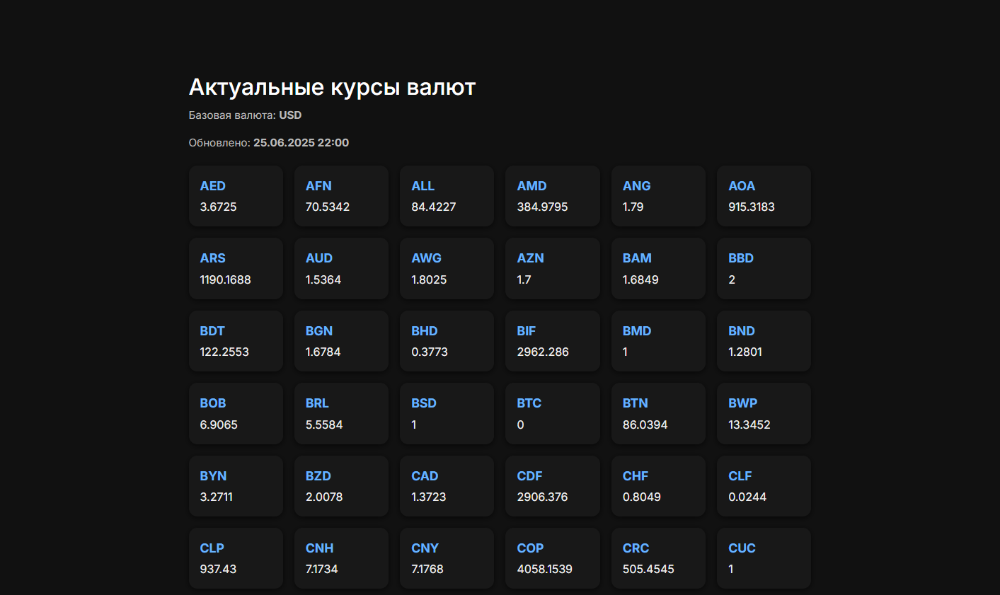

# Интеграция с Open Exchange Rates API

Проект представляет собой простое Yii2-приложение для получения и отображения курсов валют с сервиса openexchangerates.org.

## Функциональность

- Получение текущего курса валют
- Поддержка нескольких HTTP-клиентов (cURL, yii\httpclient)
- DTO-модель для структурированных данных
- Покрытие unit-тестами

## Быстрый старт

1. Клонируйте репозиторий  
```bash
   git clone https://github.com/D4-E/yii2-exchange-rates.git
   cd yii2-exchange-rates
```

2. Укажите API-ключ

Скопируйте .env.example в .env:  
```bash
   cp .env.example .env
```  
И добавьте свой ключ OpenExchangeRates в `OPENEXCHANGERATES_APP_ID`.

3. Запустите приложение через Docker  
```bash
   docker-compose up -d --build
```

4. Установите зависимости  
```bash
   docker-compose exec php composer install
```

## Тестирование

Для запуска unit-тестов:  
```bash
   docker-compose exec php vendor/bin/codecept run
```

## Интерфейс

Откройте в браузере: http://localhost:8080

Если данные недоступны — отобразится соответствующее сообщение.

## Структура проекта

- `app/infrastructure/http/` — реализация HTTP-клиентов (CurlClient, YiiHttpClient)
- `app/dto/ExchangeRatesDto.php` — DTO-объект для курсов валют
- `app/components/OpenExchangeRates.php` — компонент для получения курса валют
- `tests/` — unit-тесты

## Получение API-ключа

1. Перейдите на [https://openexchangerates.org/signup/free](https://openexchangerates.org/signup/free)
2. Зарегистрируйтесь и получите ключ
3. Укажите его в `.env`:  
`OPENEXCHANGERATES_APP_ID=your_api_key`

## Используемый стек

- PHP 8.2
- Yii2 (basic template)
- Codeception
- Docker (PHP + Nginx)
- Composer

## Скриншот


